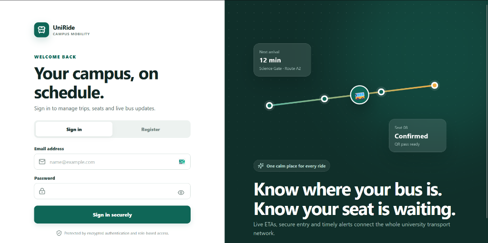
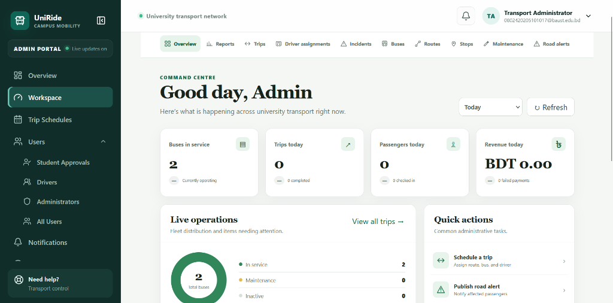
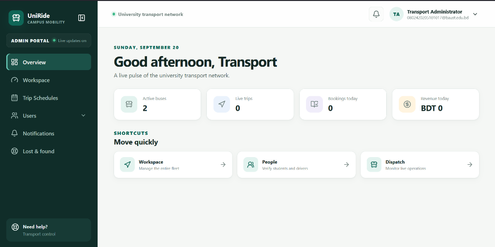
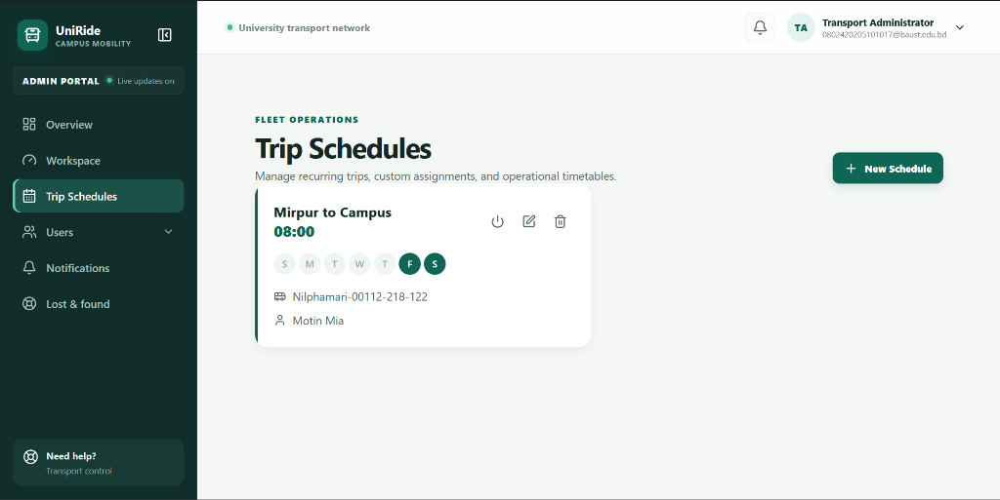
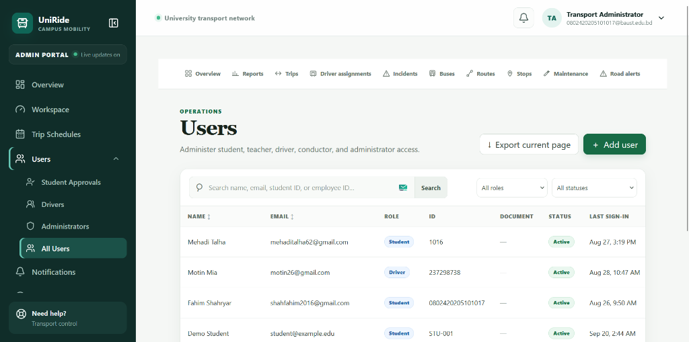

<div align="center">
  <h1>🚌 UniRide</h1>
  <p><b>University Bus Management System</b></p>
  <p>
    <a href="#features">Features</a> •
    <a href="#architecture">Architecture</a> •
    <a href="#project-structure">Project Structure</a> •
    <a href="#getting-started">Getting Started</a> •
    <a href="#documentation">Documentation</a>
  </p>
</div>

---

**UniRide** is a full-stack, real-time application built with TypeScript, React, Express, and PostgreSQL, designed specifically for university transport operations. It offers a comprehensive solution for managing fleets, scheduling trips, tracking buses, and handling student bookings.

## 📸 Screenshots

<p align="center">
  
  <br><br>
  
  <br><br>
  
  <br><br>
  
  <br><br>
  
</p>

## ✨ Features

- **🎓 Student Portal:** Seat booking (the two front seats of each bus are reserved for teachers), digital bus passes, and one personal barcode boarding card scanned by door readers on every bus.
- **🗺️ Live Tracking & GPS:** Real-time bus tracking and ETA updates via WebSockets.
- **📅 Automated Scheduling:** Set up recurring trips and let the background worker generate future schedules automatically.
- **🛡️ Admin Workspace:** RBAC-protected dashboard with dynamic role-based forms for managing users, trips, vehicles, incidents, and approvals.
- **🔔 Notifications:** Integrated Web Push notifications for trip delays, maintenance, and alerts.
- **🚦 Incident & Maintenance:** Comprehensive logging for road incidents, lost and found, and vehicle maintenance.
- **✨ Premium UI/UX:** Smooth authentication transitions, professional drag-and-drop file uploaders, and organized collapsible trip histories.

## 🏗️ Architecture

UniRide is designed as a modern **Monorepo** using npm workspaces. It separates the frontend and backend into isolated packages while sharing tooling and configuration.

### Frontend (`apps/web`)
- **Framework**: React 19 + Vite
- **Styling**: Vanilla CSS with comprehensive CSS variable theming (light mode)
- **Mapping**: Leaflet for live GPS tracking of the bus fleet
- **Capabilities**: Code 128 boarding cards (JsBarcode), PWA support (workbox), real-time WebSockets (Socket.IO client).

### Backend (`apps/api`)
- **Framework**: Node.js + Express 5
- **Database**: PostgreSQL with Prisma ORM
- **Real-time**: Socket.IO for broadcasting GPS coordinates to active clients
- **Tasks**: Background workers for automated trip scheduling and route generation.

*See the [Architecture Document](docs/ARCHITECTURE.md) for deeper design and systems notes.*

## 📁 Project Structure

```text
Bus_Management/
├── apps/
│   ├── api/                     # Backend Node.js Express server
│   │   ├── prisma/              # Prisma schema, migrations, and seed data
│   │   └── src/
│   │       ├── config/          # Validated environment configuration
│   │       ├── lib/             # Utilities (locks, logging, storage, security, geo)
│   │       ├── modules/         # Feature modules (auth, bookings, tracking, payments, admin, trips…)
│   │       ├── realtime/        # Socket.IO hub for live GPS, seats, and notifications
│   │       ├── app.ts           # Express application setup
│   │       └── server.ts        # Entry point: HTTP, Socket.IO, background monitors
│   │
│   └── web/                     # Frontend React + Vite application
│       ├── public/              # Static assets (favicon, web manifest)
│       └── src/
│           ├── components/      # Reusable UI components (shell, maps, seat map, charts)
│           ├── contexts/        # React context providers (Auth, Socket)
│           ├── hooks/           # Custom hooks (location sharing, remote data, socket events)
│           ├── lib/             # API client, formatting, exports, offline cache helpers
│           ├── pages/           # Pages organized by role (admin, driver, student, shared)
│           ├── services/        # Booking repository over the API client
│           ├── styles/          # Core CSS variables, layout, and component styles
│           ├── sw.ts            # Service worker: offline caching and Web Push
│           └── App.tsx          # Application routing (RBAC protected routes)
│
├── docs/                        # Project documentation (API, architecture, deployment, security)
├── nginx/                       # NGINX configuration for production reverse-proxy
├── package.json                 # Monorepo root configuration and workspaces
└── docker-compose.yml           # Local PostgreSQL for development
```

## 🚀 Getting Started

### Prerequisites
- Node.js 22+
- npm 10+
- PostgreSQL 15+ (or Docker)
- *Optional: Stripe CLI for payment testing*

### Quick Start
```bash
# 1. Clone the repository & copy environment variables
cp .env.example .env

# 2. Start PostgreSQL via Docker
docker compose up -d postgres

# 3. Install dependencies & initialize database
npm install
npm run db:generate
npm run db:migrate
npm run db:seed

# 4. Start the development server
npm run dev
```

> **API Health:** `http://localhost:4000/health/live`  
> **Web Client:** `http://localhost:5173`

### Default Accounts
The database seed creates these accounts (Passwords come from your `.env` `SEED_*_PASSWORD` variables, the default example is `ChangeMe123!`):

| Role | Email |
| :--- | :--- |
| **Admin** | `admin@example.edu` |
| **Driver** | `driver@example.edu` |
| **Student** | `student@example.edu` |

*(Note: In production, self-registered students require manual admin verification before login, and driver accounts can only be created by an Admin).*

## 🛠️ Quality Checks & Deployment

**Run Quality Checks:**
```bash
npm run verify # Runs lint, typecheck, test, and build in sequence
```

**Production Build:**
```bash
npm ci
npm run db:generate
npm run db:migrate
npm run build
```

*For free cloud hosting, see our [Supabase + Render Deployment Guide](docs/DEPLOY_FREE.md).*

---
<div align="center">
  <sub>Built for the future of university transport.</sub>
</div>
